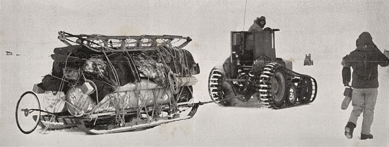

```{r setup, include=FALSE}
options(htmltools.dir.version = FALSE)
library(xaringanExtra)
xaringanExtra::use_tachyons()
library(leaflet)
library(magrittr)
library(xaringanthemer)
library(icons)

```

```{r theme, include=F}


```


# Education

.pull-left[
`r icons::icon_style(fontawesome("university", style = "solid"), scale = 1, fill = "green")`   Bsc. in Agronomic Engineering

`r icons::icon_style(fontawesome("university", style = "solid"), scale = 1, fill = "orange")`   MSc. AgrisMundus .i[(double-degree)]

`r icons::icon_style(fontawesome("university", style = "solid"), scale = 1, fill = "red")`   PhD. .i[(double-degree)]
]

.pull-right[
University of São Paulo

Montpellier SupAgro and Universidad Politecnica de Madrid

University of Tasmania and Wageningen University.
]

<br/><br/><br/><br/><br/>
.pull-bottom[.center[]
]

???

Notes are displyed here

---
# Journey around the World .gray[(for Education)]


```{r echo=FALSE, out.height="80%", out.width="100%"}
library(leaflet)
education<- cbind(as.character(c("University of Sao Paulo", "Montpellier SupAgro", "UPM Agronomos", "UTAS Spatial Sciences", "Wageningen University")),
                  as.double(c(-22.71027002221321, 43.61941877486041, 40.44231004607299,-42.90120379766455,51.98759927614859)),
                  as.double(c(-47.632869409640776, 3.8566923433588545, -3.7282129227279888, 147.32760167223316,  5.665998706757172)),
                  as.factor(c("Bachelors", "Master of Science", "Master of Science", "PhD", "PhD"))) %>% 
        `colnames<-`(c("University", "lat", "long", "Degree")) %>% as.data.frame() %>% type.convert()


getColor <- function(education) {
  sapply(education$Degree, function(Degree) {
  if(Degree <= 1) {
    "green"
  } else if(Degree <= 2) {
    "orange"
  } else {
    "red"
  } })
}

icons <- leaflet::awesomeIcons(
  icon = 'graduation-cap',
  iconColor = "black",
  library = 'fa',
  markerColor = getColor(education)
)

# legend html generator:
markerLegendHTML <- function(IconSet) {

    # container div:
    legendHtml <- "<div style='padding: 10px; padding-bottom: 15px; width: 105px'; height: 150px><h4 style='padding-top:0; padding-bottom:10px;'> Legend </h4>"

    n <- 1
    # add each icon for font-awesome icons icons:
    for (Icon in IconSet) {
        if (Icon[["library"]] == "fa") {
        legendHtml<- paste0(legendHtml, "<div style='width: auto; height: 45px'>",
                             "<div style='position: relative; display: inline-block; width: 36px; height: 45px' class='awesome-marker-icon-",
                            Icon[["markerColor"]]," awesome-marker'>",
                               "<i style='margin-left: 10px; margin-top: 15px; 'class= 'fa fa-",
                            Icon[["icon"]]," fa-inverse'></i>",
                             "</div>",
                             "<p style='position: relative; top: 15px; display: inline-block; ' >", names(IconSet)[n] ,"</p>",
                           "</div>")    
        }
        n<- n + 1
    }
    paste0(legendHtml, "</div>")
}

IconSet <- awesomeIconList(
  "BSc."   = makeAwesomeIcon(icon= 'graduation-cap', markerColor = 'green', iconColor = 'black', library = "fa"),
  "MSc." = makeAwesomeIcon(icon= 'graduation-cap', markerColor = 'orange', iconColor = 'black', library = "fa" ),
  "PhD" = makeAwesomeIcon(icon= 'graduation-cap', markerColor = 'red', iconColor = 'black', library = "fa")
)


# html_legend <- "green<br/>
# red"

m<- leaflet(education) %>% setView(lng = 0, lat = 0, zoom = 1) %>% 
   addTiles() %>%  # Add default OpenStreetMap map tiles
   addAwesomeMarkers(lng=~long, lat=~lat, icon = icons, label = ~as.character(education$University) ) %>% 
    addControl(html = markerLegendHTML(IconSet = IconSet), position = "topright")

m
```


---
class: top, left

# .dark-green[Self-evaluation]

.pull-left[
## .purple[Current Skills]
.gray[
- Strong background in ag-tech

- Machine (Statistical) Learning

- Remote Sensing & Chemometrics

- Multispectral and Hyperspectral Analysis

- R programming
]]

.pull-right[ ## .purple[To develop]
.gray[
- Image Analysis (i.e. CV, patterns )

- Front-end (Shiny) 

- Python + DL (Keras, Tensorflow)

- Databases (SQL)

- Cloud Computing (GEE + Data Cubes)

]]

---
# Workflow

.pull-left[
## How do I make sure things get done?
- Time Management (Focus/Deep Work), 
- Minimal Number of Meetings,
- Clear Hierarchy, Goals and Deliverables,
- Enough Rest and Time-Off Work.]

.pull-right[
## How do I organize my workflow:
- Data Collection + Cloud Backup,
- Rmarkdown (Data Analysis) + Git,
- Rmarkdown +LaTeX + Overleaf,
- Manuscript Submission (LaTeX).]

</br>
_Science is a lifestyle. As an athlete it requires daily and continued efforts._


---
<br>
## What would I like to achieve in PostDoc:

- Teaching Experience & Research Group Management 

- Enhance my profile as researcher 

- Full-stack dev from spectral data to decision support tool

<br><br>

## What do I bring from my PhD:
- Back-end (modeling, validation, feature selection) 

- Optimized workflow 

- Good judgment


---


# Research Mindsets .gray[(Polar Exploration )]
.pull-left[
 ## Robert Scott 
  
  </br></br></br></br>
  - Everything the money can buy
  - Complex Structure
  - Ego focused
  - Prize/Fame is the goal
]
.pull-right[
## Roald Amundsen 
  .right[]
  - Team Focused
  - Necessary Resources 
  - Team Planning 
  - Autonomy

]


---
# Future of Agriculture - .gray[trends]

.pull-left[
## Remote Sensing

- Accessible & Actionable 

- Scalabity of Solutions _(GEE + IoT)_ 

- Higher availability of Data _(Open Data Cubes)_
]


.pull-right[
## Precision Agriculture

- Farming Data _(Decision Support Tools)_,

- Robotics _(Labor Shortages)_,

- Agriculture in Marginal Areas.]


---
exclude:TRUE
# Efficiency in Research

## Identifying Research Question (Popper)


## Amundsen vs. Scott (Polar Expedition


)

---
class: middle, center

# Final message
## The most important thing

__What can I do to contribute?__


<!-- <video width="560" height="400" preload="none" controls="controls" autoplay> -->
<!-- <source src="Presentation_Gustavo_files/figure-html/postdoc_me.mp4" type="video/mp4"> -->
<!-- </video> -->


